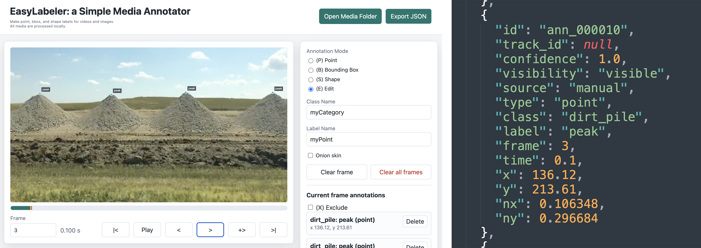

# EasyLabeler

**EasyLabeler** is a simple media annotator: a small local-first web app for labeling points, bounding boxes, and closed shapes on short `.mp4` videos or folders of images. It uses plain HTML, CSS, and JavaScript, and produces JSON annotation files. It has no backend, build system, cloud services, or external dependencies.



**Contents:**

* [Run Locally](#run-locally)
* [Load Media](#load-media)
* [The Project JSON](#)
* [Label Points, Boxes, and Shapes](#)
* [Timeline Controls](#)
* [Onion-Skinning](#)
* [Export JSON](#)
* [Render Point Overlays](#)
* [Known Limitations](#)
* [Code Layout](#)
* [Notes for Agents](#)

---

## Run Locally

It's common for browsers to restrict JavaScript applications from opening local files. To launch EasyLabeler, therefore, you should open your Terminal app and run a tiny local server from this folder:

```bash
cd /path/to/easylabeler/
python3 -m http.server 8000
```

Then open the URL `http://localhost:8000`.


---

## Load Media

Click **Open Media Folder** and choose a folder containing either one local video or a flat image sequence. Media stays on your computer and is loaded with browser object URLs.

If the folder contains one video, the app loads it as a video project. If the folder contains several images and no video, the app sorts the image filenames naturally and treats them as sequential frames. For example, the sample folder `media/images/bellybutton/` loads as a short frame sequence.

If a folder has multiple videos, the app uses a compatible project JSON to choose the matching video when possible. Otherwise, it asks which video to load.

If the folder also contains a compatible annotation JSON, the app loads those annotations automatically. Video JSON is matched by metadata such as `source_filename` or `source_video_path`. Image JSON is matched when `images[].filename` entries match the image files in the selected folder.


---

## The Project JSON

Compatible project JSON files are loaded automatically if/when they are in the selected media folder. The exported JSON includes `metadata.source_video_path` for video projects and grouped `images` entries for image projects.

The JSON acts like a project file: choose the media folder that contains both the media and compatible JSON, and the app will restore the annotations it can match.


---

## Label Points, Boxes, and Shapes

- The app starts in **Edit mode** when it opens and after loading media, which helps prevent accidental new annotations.
- **Point mode:** click and release on the media to create a point annotation.
- **Bounding box mode:** click, drag, and release to create a box.
- **Shape mode:** click to add vertices for a closed polyline. Click near the first vertex, shown as a small circle, to close and save the shape.
- **Edit mode:** click an annotation to select it. Drag points to move them. Drag deep inside boxes or inside shapes to move them. Drag box corners or shape vertices to resize/edit them.
- Press **P**, **B**, **S**, or **E** to switch between Point, Bounding Box, Shape, and Edit modes unless an input field is focused.

Use **Class Name** for the object/category and **Label Name** for the part or annotation name before creating an annotation. Class Name defaults to `myCategory`. Point, Bounding Box, and Shape label names default to `myPoint`, `myBoundingBox`, and `myShape`. Multiple classes, labels, and annotations per frame are allowed.

In Edit mode, selecting an annotation fills Class Name and Label Name with that annotation's values. Change either field and press Enter or leave the field to rename the selected annotation.

The annotation list shows only annotations on the current frame. Use **(X) Exclude** or press **X** to mark the current frame as corrupt, glitched, irrelevant, or otherwise unsuitable for training; excluded frames draw a thin red X over the media. Use **Delete** in the list, or select an annotation and press Backspace/Delete.

Press **Z** to undo the most recent annotation change, including accidental point, box, or shape additions.


---

## Timeline Controls

- **Frame:** type a frame number and press Enter, or leave the field, to jump to that frame.
- The progress bar under the media shows the current frame position across the loaded video or image sequence.
- **Transport controls:** `|<`, `Play`, `<`, `>`, `+>`, `>|`.
- **Play:** advances through frames using the same frame-step path as the next-frame button, at the project FPS.
- **+>:** copies all annotations on the current frame to the next frame with fresh IDs, then jumps to that next frame.
- **Spacebar:** pause or resume playback, unless an input field is focused.
- **Left / Right arrow keys:** previous frame and next frame, unless an input field is focused. Next frame wraps from the final frame to frame 0.
- **Shift + Right Arrow:** copy annotations to the next frame, unless an input field is focused.
- Playback loops automatically while video or image sequences are playing.
- For videos, the app tracks the requested frame number directly and seeks to the middle of that frame's time span. For image folders, each image is one frame. The FPS value is stored in exported project JSON.
- Annotation mode and clear-frame controls are disabled during playback.


---

## Onion-Skinning

Enable **Onion skin** to show annotations from the previous frame as a faint reference.

Onion-skin annotations are visual references only. They are not included in the current frame annotation list unless they actually belong to the current frame.


---

## Export JSON

Click **Export JSON** to download an annotation/project JSON file.

Video projects use a flat annotation list:

```json
{
  "metadata": {
    "source_filename": "example.mp4",
    "source_video_path": "example.mp4",
    "media_type": "video",
    "image_folder": "",
    "image_count": 0,
    "media_width": 1920,
    "media_height": 1080,
    "video_width": 1920,
    "video_height": 1080,
    "fps": 30,
    "created_with": "minimal-media-annotator"
  },
  "excluded_frames": [42, 87, 113],
  "annotations": []
}
```

Image-folder projects group annotations by image:

```json
{
  "metadata": {
    "media_type": "images",
    "image_folder": "bellybutton",
    "image_count": 16,
    "media_width": 1280,
    "media_height": 720,
    "fps": 30,
    "created_with": "minimal-media-annotator"
  },
  "excluded_frames": [3, 9],
  "images": [
    {
      "frame": 0,
      "filename": "bellybutton_00000.jpg",
      "path": "bellybutton/bellybutton_00000.jpg",
      "width": 1280,
      "height": 720,
      "annotations": []
    }
  ]
}
```

All annotations include `class` and `label`. Use `class` for the object/category, such as `dirt_pile`, and `label` for a part or annotation name, such as `peak`.

Example point annotation:

```json
{
  "type": "point",
  "class": "dirt_pile",
  "label": "peak",
  "track_id": null,
  "confidence": 1.0,
  "visibility": "visible",
  "source": "manual"
}
```

Project JSON files includes a top-level `excluded_frames` array containing zero-based frame indices to omit selected frames from model-training datasets.

All exported annotations include training-oriented metadata: `track_id`, `confidence`, `visibility`, and `source`. Manually created annotations default to `track_id: null`, `confidence: 1.0`, `visibility: "visible"`, and `source: "manual"`.

Coordinates are stored in original video or image pixel coordinates. Normalized coordinate values ( `nx` and `ny`) go from `0...1` and are relative to the original media's width and height.

Annotations on video content include `time`. Image-batch annotations do not include `time`. Supported annotation types include:

* **Point** annotations include `x`, `y`, `nx`, and `ny`.
* **Bounding box** annotations include `x`, `y`, `width`, `height`, `nx`, `ny`, `nwidth`, and `nheight`. 
* **Shape** annotations (polygons) include `points`, with each point storing `x`, `y`, `nx`, and `ny`.


---

## Render Point Overlays

For a visual timing check, `test/render_point_overlays.py` loads a video and annotation JSON, draws circles for `point` annotations, and exports annotated PNG frames.

Create and install the local Python environment:

```bash
python3 -m venv venv
venv/bin/python -m pip install -r test/requirements.txt
```

Run the default `piles_test` export:

```bash
venv/bin/python test/render_point_overlays.py
```

By default, it reads `media/video/piles_test/piles_test.mp4` and `media/video/piles_test/piles_test_annotations.json`, then writes PNGs to `media/video/piles_test/annotated_frames/`.


---

## Known Limitations

- Image folders are expected to contain frames with the same dimensions. Consider using `ffmpeg` to regularize your image collection prior to annotation.
- EasyLabeler is intended for short videos and lightweight classroom use. You may hit browser memory limitations with larger media.
- No model training is implemented here; see the `easytrain-yolo` subproject. 
- No automatic tracking is implemented here.
- Video frame accuracy depends on browser video seeking and the project FPS value matching the media's intended frame rate.
- Image folder loading uses browser directory selection support, commonly exposed as `webkitdirectory`.
- Project JSON files can only auto-load MP4 paths the browser is allowed to reach; otherwise, choose the MP4 manually after opening the JSON.


---

## Code Layout

- `index.html` defines the static controls and media/canvas stack.
- `style.css` handles the compact app layout, overlay cursor, progress bar, and annotation controls.
- `app.js` owns all browser behavior: media loading, frame stepping, coordinate conversion, drawing, editing, import/export, and keyboard shortcuts.
- `test/render_point_overlays.py` is an optional test helper for checking point annotations against decoded video frames.


---

## Notes for Agents

- This is intentionally a no-build, local-first app. Avoid adding a framework, backend, bundler, cloud dependency, or package manager unless the user explicitly changes that constraint.
- Main UI files are `index.html`, `style.css`, and `app.js`. The Python code in `test/` is only for verification exports and should not be required to run the browser annotator.
- `app.js` keeps all annotations in one array and excluded frames in an `excludedFrames` set. Video projects export a flat `annotations` array; image projects export grouped `images[]` entries with each image filename and that frame's annotations. Both formats export top-level `excluded_frames`.
- Export backfills `class` and model-training metadata (`track_id`, `confidence`, `visibility`, `source`) on all annotations while preserving any existing imported values for those fields.
- Annotation coordinates are intrinsic media pixels, not CSS pixels. Use `canvasToVideo()` and `videoToCanvas()` for coordinate transforms; do not derive annotation coordinates from displayed element sizes directly.
- Video frame state is logical and explicit: `currentVideoFrameIndex` is the source of truth for the current frame. The video element is seeked to the midpoint of the frame interval with `getSeekTimeForFrame()` to avoid browser boundary-seek ambiguity.
- `getMaxFrame()` returns the largest valid zero-based frame index. For a 41-frame video, valid frames are `0..40`; do not change this back to `duration * fps`.
- Playback is simulated frame stepping through `startVideoFramePlaybackLoop()`, not native `video.play()`. Native video looping is disabled because it caused wrong-frame display near the end of short MP4s.
- The default annotation mode is Edit (`select`) on startup and after loading media to reduce accidental point creation.
- Onion skinning shows only the previous frame. It is a drawing aid and does not affect the current-frame annotation list or JSON export.
- Image-folder projects use browser directory selection (`webkitdirectory`) and assume a flat image directory. If a compatible JSON is in the selected folder, the app auto-loads it.
- Verification commands used during development: `node --check app.js`, `venv/bin/python -B -m py_compile test/render_point_overlays.py`, and `venv/bin/python test/render_point_overlays.py`.

---
