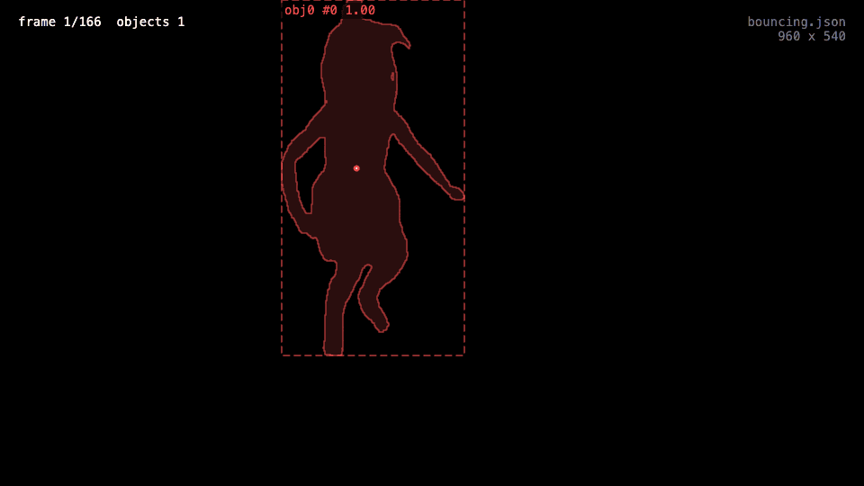
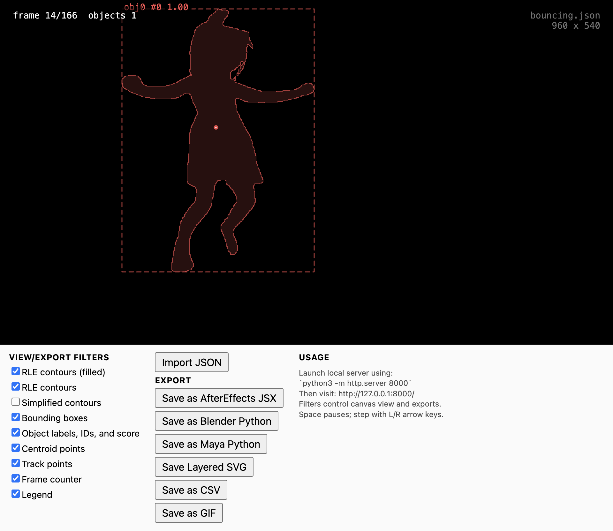

# EasyTrack Viewer

[**This p5.js utility**](p5_easytrack_viewer/index.html) loads and previews JSON files produced by other EasyTracking apps. Additionally, it can convert your JSON data into formats useful within AfterEffects, Blender, and Maya, as well as CSV, SVG, and GIF. 

To run the program, it needs to be served from a local web server, because the sketch loads local files. To run it locally on a Mac:

1. Download or clone this repository.
2. Open Terminal.
3. At the Terminal command line, navigate into the `p5_easytrack_viewer/` folder: `cd path/to/p5_easytrack_viewer`
4. Download the contents of [`p5_easytrack_viewer/`](p5_easytrack_viewer)
5. Start a local web server, using e.g. `python3 -m http.server 8000`
6. Open a browser to that page: `http://127.0.0.1:8000/`
7. Use the *Import JSON* button to load your JSON file. 
8. The *View/Export* filter checkboxes enable which data you can see, as well as which data streams will appear in any exported files. 

