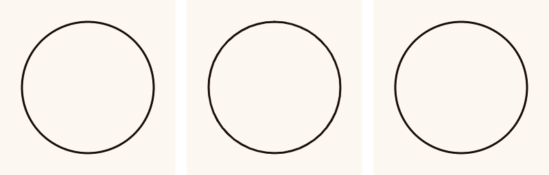
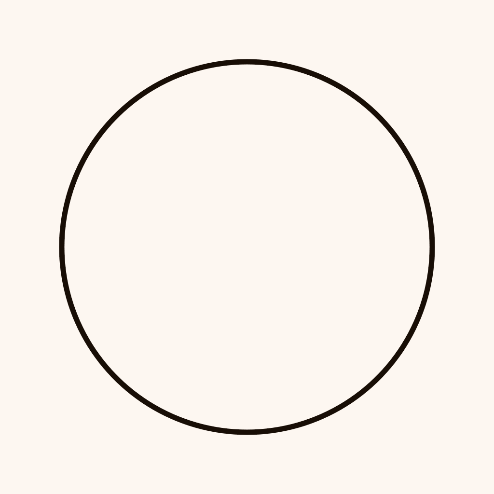
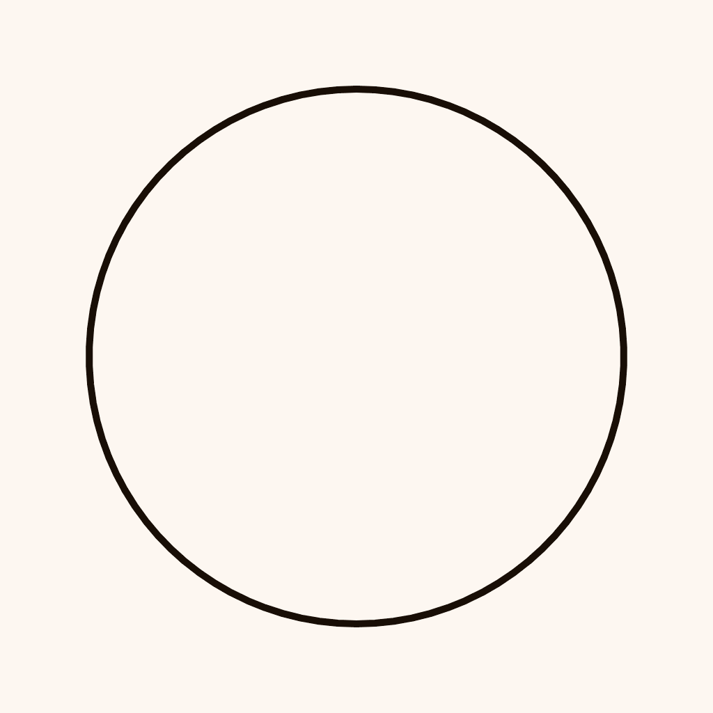

# Interpolation in Computer Art, Part Two: A Pedagogical Sketchbook

*This article details a Pedagogical Sketchbook of geometric interpolations, offered for collection as non-fungible tokens. For information on the concepts behind these works, please see [Part One](https://medium.com/@golanlevin/interpolation-in-computer-art-part-one-a-brief-personal-tour-6052d997fdf). To browse the NFTs, [visit here](https://objkt.com/profile/tz1eQThmh9yuuxjvFBWbRGKUr2goUw1gAd39/created). This article was originally published on [Medium.com](https://medium.com/@golanlevin/interpolation-in-computer-art-part-two-a-pedagogical-sketchbook-ed4e5f4562f0).*

---

Interpolation is central to creative coding, both as a technique and as a subject. In late 2017, inspired by the examples I discuss in Part One of this article, I challenged myself to come up all of the ways that I could interpolate from a circle to a triangle—the Platonic extremes of geometric smoothness and pointiness—in a week’s time. I devised and implemented fourteen interpolation methods, which are indexed and described in this article.

I set myself the rule that all of the interpolations should consist of simple polylines and/or connected sequences of arcs and simple curves, such as could be executed by a mechatronic pen-plotter like an AxiDraw. In the spirit of Paul Klee’s 1925 [*Pedagogical Sketchbook*](https://en.wikipedia.org/wiki/Pedagogical_Sketchbook), my vision was to develop animations that had pedagogic value through their combination of a distinctive visual character and a unique conceptual or algorithmic approach.

The resulting sketchbook resides on the blockchain, and each of its “pages”, or online NFTs, is minted with its complete p5.js (JavaScript) source code in its accompanying metadata. The full set of fourteen interpolations are durably formatted as animated GIFs, and were minted daily from November 1–14, 2021, as low-carbon NFTs on the Tezos blockchain.

In recognition of the [20th anniversary of the Processing family of creative coding toolkits](https://processingfoundation.org/advocacy/pcd-2021) (which were used to develop the studies), and with the help of WG3.2’s “[collab contract](https://github.com/wg32/collab-contract-doc)”, these NFTs automatically share 20% of all proceeds, for both primary and secondary sales, in perpetuity, with the Processing Foundation. Creative coding toolkits like Processing and p5.js are the backbone of an enormous creative community, but are developed by tiny teams with few resources. I feel strongly that this new smart contract is an important contribution in [supporting the creation of open-source software development toolkits for the arts](https://github.com/CreativeInquiry/OSSTA-Report), and I hope this project can help serve as an example of this mode of support.

## ◯⟷△ №.01.

Interpolation From a Circle to an Equilateral Triangle (#01): A circle is treated as a (rounded) triangle, whose rounded corners have a dynamic radius. (11/01/2021 • [Code](code/circle_to_triangle_01.js))

 <small>◯⟷△ №.01 • [Objkt #494518](https://objkt.com/asset/hicetnunc/494518)</small>

## ◯⟷△ №.02.

Interpolation From a Circle to an Equilateral Triangle (#02): In which a circle is approximated by three circular arcs, whose radii dynamically lengthen to infinity. (11/02/2021 • [Code](code/circle_to_triangle_02.js))

 <small>◯⟷△ №.02 • [Objkt #494889](https://objkt.com/asset/hicetnunc/494889)</small>

## ◯⟷△ №.03.
Interpolation From a Circle to an Equilateral Triangle (#03): By gradually flattening a circle on three sides. (11/03/2021 • [Code](code/circle_to_triangle_03.js))

 <small>◯⟷△ №.03 • [Objkt #494899](https://objkt.com/asset/hicetnunc/494899)</small>

## ◯⟷△ №.04.

Interpolation From a Circle to an Equilateral Triangle (#04): By considering it as a set of alternating straight lines and 120° arcs, in which the arcs shrink while the lines grow. (11/04/2021 • [Code](code/circle_to_triangle_04.js))

 <small>◯⟷△ №.04 • [Objkt #494924](https://objkt.com/asset/hicetnunc/494924)</small>

## ◯⟶△ №.05.

Interpolation From a Circle to an Equilateral Triangle (#05): By sampling a circle into many segments, and then locally averaging (blurring) each contour point with its neighbors, except for the three special corner vertices. (11/05/2021 • [Code](code/circle_to_triangle_05.js))

 <small>◯⟶△ №.05 • [Objkt #494951](https://objkt.com/asset/hicetnunc/494951)</small>

## ◯⟷△ №.06.

Interpolation From a Circle to an Equilateral Triangle (#06): By progressively deleting all vertices along a resampled circle, except for three special vertices, which constitute the triangle’s corners. (11/06/2021 • [Code](code/circle_to_triangle_06.js))

 <small>◯⟷△ №.06 • [Objkt #495621](https://objkt.com/asset/hicetnunc/495621)</small>

## ◯⟷△ №.07.

Interpolation From a Circle to an Equilateral Triangle (#07): By gradually shrinking the circle’s radius, revealing triangular corners within. (11/07/2021 • [Code](code/circle_to_triangle_07.js))

 <small>◯⟷△ №.07 • [Objkt #495720](https://objkt.com/asset/hicetnunc/495720)</small>

## ◯⟷△ №.08.

Interpolation From a Circle to an Equilateral Triangle (#08): By treating the circle as a multisided polygon whose number of sides gradually decreases to three. (11/08/2021 • [Code](code/circle_to_triangle_08.js))

 <small>◯⟷△ №.08 • [Objkt #497790](https://objkt.com/asset/hicetnunc/497790)</small>

## ◯⟷△ №.09.

Interpolation From a Circle to an Equilateral Triangle (#09): By progressively rendering it as a 3-gon, 6-gon, 12-gon, 24-gon, 48-gon, etcetera, with smooth interpolations. (11/09/2021 • [Code](code/circle_to_triangle_09.js))

 <small>◯⟷△ №.09 • [Objkt #497907](https://objkt.com/asset/hicetnunc/497907)</small>

## ◯⟷△ №.10.

Interpolation From a Circle to an Equilateral Triangle (#10): By treating points along the perimeter as a series of springy particles. (11/10/2021 • [Code](code/circle_to_triangle_10.js))

 <small>◯⟷△ №.10 • [Objkt #498129](https://objkt.com/asset/hicetnunc/498129)</small>

## ◯⟷△ №.11.

Interpolation From a Circle to an Equilateral Triangle (#11): By progressively moving points evenly sampled along the circle, towards points on the triangle, resampled at equal intervals, by small random amounts. (11/11/2021 • [Code](code/circle_to_triangle_11.js))

 <small>◯⟷△ №.11 • [Objkt #518876](https://objkt.com/asset/hicetnunc/518876)</small>

## ◯⟷△ №.12.

Interpolation From a Circle to an Equilateral Triangle (#12): By treating the form as a series of six circular arcs, whose radii alternate between small and large. (11/12/2021 • [Code](code/circle_to_triangle_12.js))

 <small>◯⟷△ №.12 • [Objkt #527900](https://objkt.com/asset/hicetnunc/527900)</small>

## ◯⟷△ №.13.

Interpolation From a Circle to an Equilateral Triangle (#13): By linearly interpolating points on the circle towards points on the triangle, along radii of the circle. (11/13/2021 • [Code](code/circle_to_triangle_13.js))

 <small>◯⟷△ №.13 • [Objkt #532046](https://objkt.com/asset/hicetnunc/532046)</small>

## ◯⟷△ №.14.

Interpolation From a Circle to an Equilateral Triangle (#14): By approximating a circle with three Bézier cubic splines and modulating the spline control points. (11/14/2021 • [Code](code/circle_to_triangle_14.js))

 <small>◯⟷△ №.14 • [Objkt #532206](https://objkt.com/asset/hicetnunc/532206)</small>

## Acknowledgments

The studies in this *Pedagogical Sketchbook* were developed using [Processing](https://processing.org/) and [p5.js](https://p5js.org/), amazing tools which have given livelihoods and community to a vast group of creative people. Thanks to Daniel Shiffman for originally proposing that I share these studies with a wider public, and for [hosting my presentation about them](https://www.youtube.com/watch?v=mvgcNOX8JGQ) on his popular YouTube platform, the *Coding Train*. These studies were released using a beta test of the WG3.2 team’s “collab contract” — by means of which the Processing Foundation contractually received (and will forever receive) 20% of all sales. I’m grateful to 1x1_NFT for sharing access to this with me, to Casey Reas for encouragement, and to the many collectors, especially including nftbiker, digitalcoleman, huwythechew, memotv, drew_y_art, wblut, RichardNadler1, jk__keller, and bit_checker_pro whose support made this project possible.

## Keywords

Creative Coding, Interpolation, Circle, Triangle, New Media Arts, Pedagogy, Processing, p5.js
