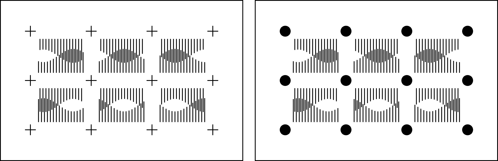
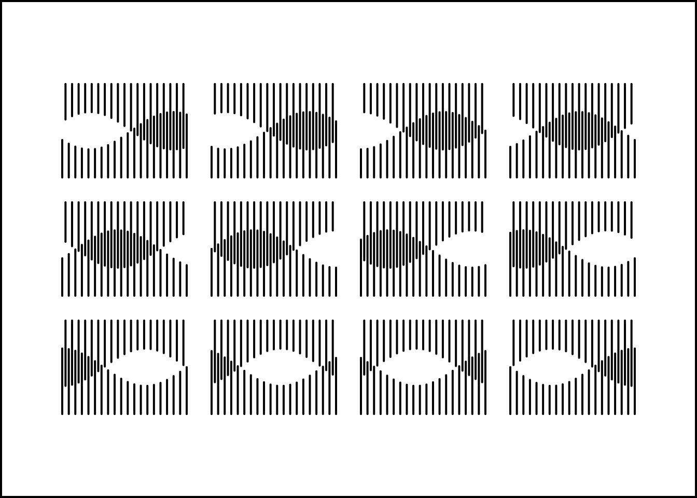
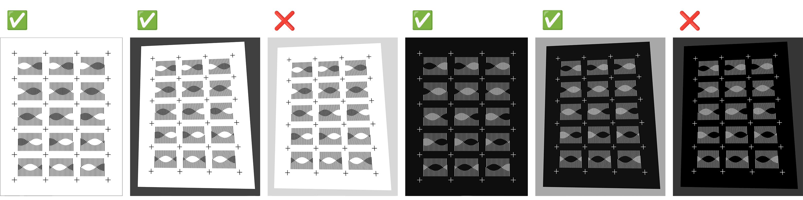
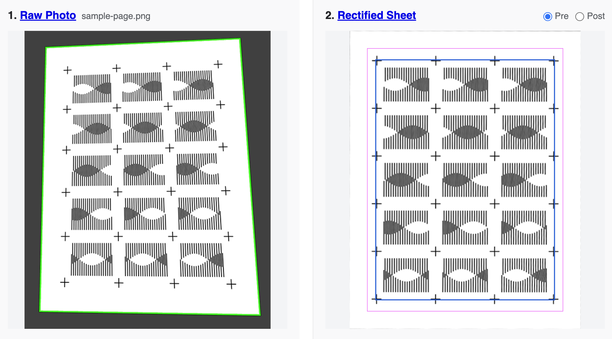

# Plottimation Tool

[This free tool](https://golanlevin.github.io/plottimation/) builds a looping GIF from a scan or photograph of an animation contact-sheet. It automatically aligns the frames; works both with or without alignment markers; and can even work with casual photographs. You can find the tool [**here**](https://golanlevin.github.io/plottimation/). 
Version 1.15 • By @GolanLevin, Spring 2026.

* [**Plottimation Tool Online Here**](https://golanlevin.github.io/plottimation/)
* [**Quickstart Instructions**](#quickstart-instructions) (below)
* [**Documentation**](documentation.md)
* [p5.js Design Templates](templates/README.md)
* [Demonstration Video](https://www.youtube.com/watch?v=MOXB63DgItQ)
* [GIF Gallery](#plottimation-gif-gallery)

---

## Quickstart Instructions

1. **Create** a "frame sheet" of your animation. You can work in either of two ways:
   - **With Markers.** Make a marker-based sheet, with frames separated by small crosses (`+`) or filled circular dots (`●`), rendered in a high-contrast ink. [Here's a p5.js sketch](https://editor.p5js.org/golan/sketches/_ZMbagYFc) to get started. Using markers gives the most accurate frame alignment. 
   - **Or, Without Markers.** Create a markerless sheet, with frames separated by empty gutters. *Note:* depending on your design, the markerless pipeline may produce more jittery animations. 
2. **Photograph or scan** your frame sheet. It's OK to use a casual photo, but your page must have good contrast against a plain background. For example, a light-colored sheet should be completely surrounded by a uniform dark background, as shown [here](demo/1_dmawer_crosses.jpg) and below. It is *strongly recommended* to keep the resolution of your frame sheet under 8000×8000 pixels. 
3. **Open** the [**Plottimation Tool**](https://golanlevin.github.io/plottimation/) in a browser, from [**here**](https://golanlevin.github.io/plottimation).
4. **Load** the image of your frame sheet into the Plottimation Tool. You can do this by dragging your image file onto the Tool's load target (where it says "Drop a photo or scan here"), or by clicking the target to load a file.
5. Under the *Layout* tab, **set** `Frame Columns` and `Frame Rows` to match the layout of your sheet's grid of frames. You should also set your sheet's orientation (landscape or portrait) and page size (11×8.5, etc.).
6. It's time to **detect** your page and **extract** its grid of frames. **Adjust** the `Page Detection Threshold` slider in the *Page & Grid Detection* tab until you see a bright green frame around your page in the `Raw Photo` panel. You may also need to adjust other settings, such as the `Grid Search Inset`. If your sheet uses light ink on dark paper, enable `Light-on-dark design`. 
7. **Choose** the correct `Alignment Pipeline` for your frame sheet:
   - `Markers (crosses, dots)` for marker-separated sheets, or 
   - `Markerless (gutters, frames)` for gutter-separated sheets without registration marks
8. If you select `Markerless`, you will probably want to **enable stabilization** in the *Stabilization* tab. 
9. According to your taste, **adjust** the settings under the *Appearance* and *Crop & Geometry* tabs. Changes to these settings are reflected in the animation shown in the *Preview & Export* panel.
10. To generate and download your GIF animation, **click** `↓GIF`. You can also download your animation as an MP4 movie or a zipped folder of frames. There are advanced settings in the *Export Options* tab for adjusting output dimensions, compression quality, and playback modes.
11. You can **save** your animations' settings file to save time later; find a button for doing this at the bottom of the "Export Options" panel.

---

## Plottimation GIF Gallery

*All animations are © their respective authors, and are used in this project with permission.*

 

 Plot by Golan Levin (@golanlevin)

 

 Plot by Julien Gachadoat ([@julienv3ga](https://www.instagram.com/julienv3ga/))

 
 
 Risograph by Alex Barsky ([@zinehug](https://www.instagram.com/zinehug))

 

 Risograph by Alex Barsky ([@zinehug](https://www.instagram.com/zinehug))

 

 "Summoner" Risograph by Zack Lydon ([@zinehug](https://www.instagram.com/zinehug))

 

 "A" Risograph by Kelli Anderson ([@kellianderson](https://www.instagram.com/kellianderson/))  

 Cyanotype by Kelli Anderson ([@kellianderson](https://www.instagram.com/kellianderson/)) 

<!-- 

References: 

* [Spectrolite Riso Animation](https://spectrolite.app/how-to/art-and-animation/riso-animation)

-->
