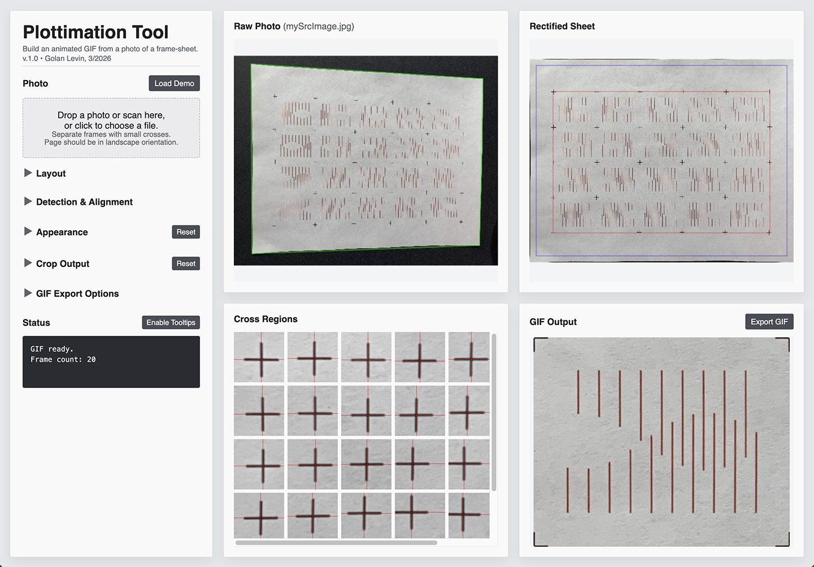
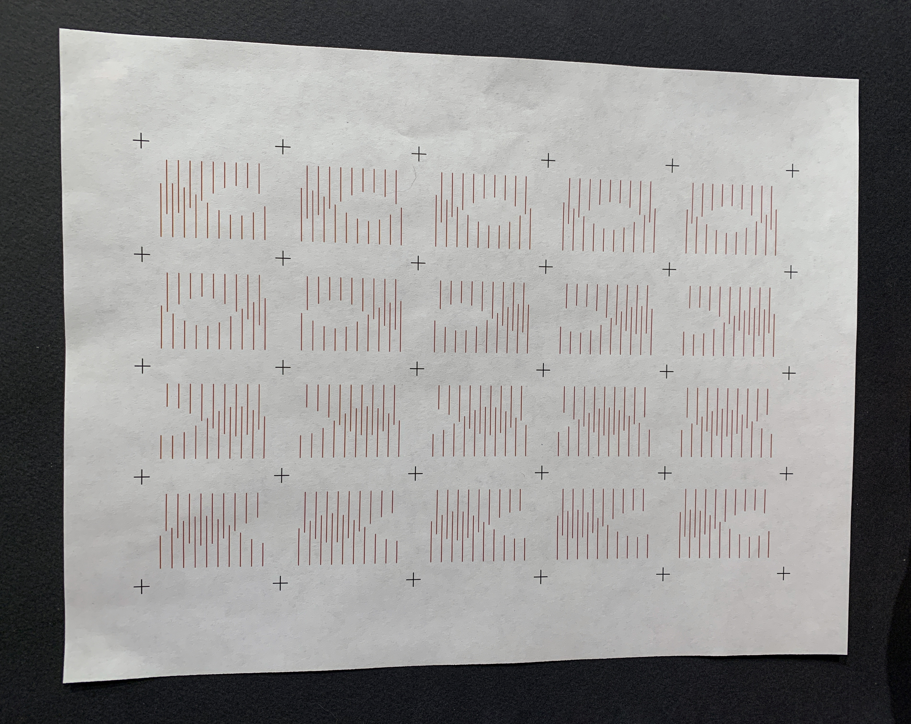

# Plottimation Tool

This tool builds an animated GIF from a photo or scan of a plotted frame-sheet. 
Version 1.0 • March 2026 • By Golan Levin

## How To Use It

1. Open `plottimation_webtool/index.html` in a browser.
2. Drag in a photo or scan of your plotted sheet, or click `Load Demo`.
3. Set `Frame Columns` and `Frame Rows` to match your layout.
4. Choose the correct paper size.
5. If needed, adjust detection, appearance, crop, or export settings.
6. Review the `Animation Preview`.
7. Click `Export GIF` to generate and download the final GIF.

---

## Preparing A Good Input Image

Your sheet should:

- be photographed or scanned in landscape orientation
- show the entire page
- be surrounded by a darker background 
- contain a complete grid of small, dark, regularly-spaced `+` crosses separating the frames of your animation

Those small crosses are important. They define the frame grid and are used for alignment. See [this example image](demo/mySrcImage.jpg):

## An Example Output

