# Plottimation Tool

[This free tool](https://golanlevin.github.io/plottimation/) builds a looping GIF from a scan or photograph of an animation contact-sheet. It automatically aligns the frames; works both with or without alignment markers; and can even work with casual photographs. You can find the tool [**here**](https://golanlevin.github.io/plottimation/). 
Version 1.14 • By @GolanLevin, Spring 2026.

* [**Plottimation Tool Online Here**](https://golanlevin.github.io/plottimation/)
* [**Quickstart Instructions**](#quickstart-instructions) (below)
* [**Documentation**](documentation.md)
* [p5.js Design Templates](templates/README.md)
* [Demonstration Video](https://www.youtube.com/watch?v=MOXB63DgItQ)
* [GIF Gallery](#plottimation-gif-gallery)

[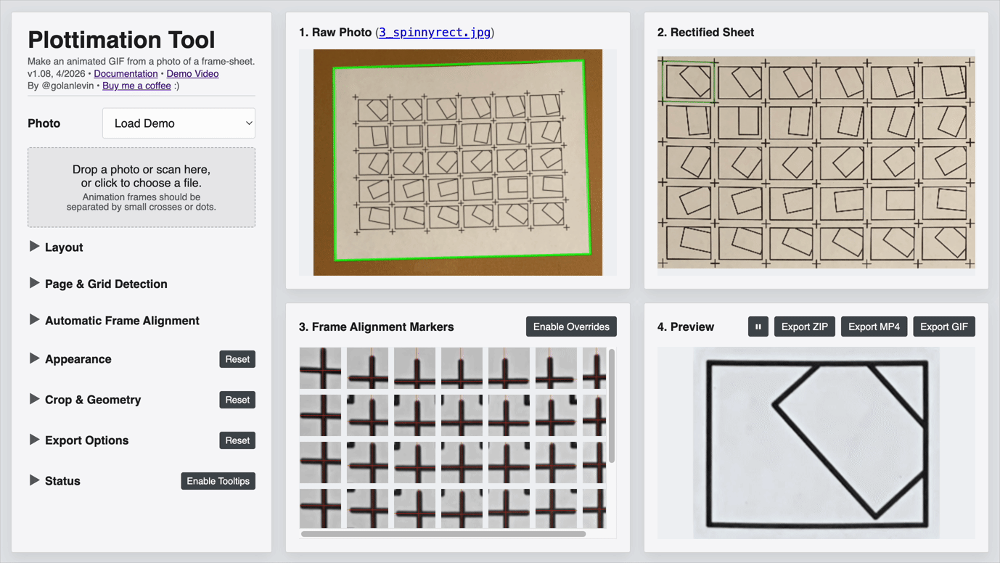](https://golanlevin.github.io/plottimation/)

## Quickstart Instructions

1. **Create** a "frame sheet" of your animation. You can work in either of two ways:
   - a marker-based sheet, with frames separated by small crosses (`+`) or filled circular dots (`●`).  To make a design, [here's a p5.js sketch](https://editor.p5js.org/golan/sketches/_ZMbagYFc) you could get started with.
   - a markerless sheet, with frames separated by empty gutters.
2. **Photograph** or scan your frame sheet. It's ok to use a casual photo — but a light-colored sheet should be completely surrounded by a uniform dark background (or vice-versa), as shown in [this example](demo/1_dmawer_crosses.jpg). It is strongly recommended to keep the maximum dimension of your frame sheet under 8000 pixels.
3. **Open** the [**Plottimation Tool**](https://golanlevin.github.io/plottimation/) in a browser, from [here](https://golanlevin.github.io/plottimation).
4. **Load** the image of your frame sheet into the Plottimation Tool. You can do this by dragging your image file onto the Tool's load target (where it says "Drop a photo or scan here"), or by clicking the target to load a file. As an alternative, you can click `Load Demo` instead.
5. Under the *Layout* tab, **set** `Frame Columns` and `Frame Rows` to match the layout of your sheet's grid of frames. You should also set your sheet's orientation (landscape or portrait) and page size (11×8.5, etc.).
6. On the "Raw Photo" panel, you should see a green line around your page. If the panel shows a warning symbol ⚠️, or if there is no green line around your sheet, or if the green line is incorrect, you may need to **adjust** the thresholding settings in the *Page & Grid Detection* tab. Try experimenting with the `Thresholding Offset` slider first. If your sheet uses light ink on dark paper, enable `Light-on-dark design`.
7. Choose the correct `Alignment Pipeline`:
   - `Markers (crosses, dots)` for marker-separated sheets
   - `Markerless (gutters, frames)` for gutter-separated sheets without registration marks
8. According to your taste, **adjust** the settings under the *Appearance* and *Crop & Geometry* tabs. Changes to these settings are reflected in the animation shown in the *Preview & Export* panel.
9. To generate and download your GIF animation, **click** `↓GIF`. You can also download your animation as an MP4 movie or a zipped folder of frames. There are advanced settings in the *Export Options* tab for adjusting output dimensions, compression quality, and playback modes.
10. Consider saving out your animations' settings file. You can find a button for doing this at the bottom of the "Export Options" panel.

---

## Plottimation GIF Gallery

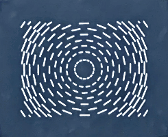 
[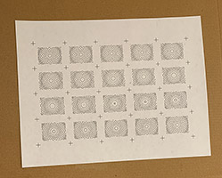](demo/2_plot_concentric.jpg)
 Plot by Golan Levin (@golanlevin)

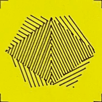 
[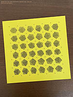](demo/4_plot_julienv3ga.jpg)
 Plot by Julien Gachadoat ([@julienv3ga](https://www.instagram.com/julienv3ga/))

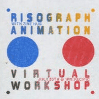 
[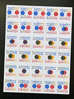](demo/6_riso_zinehug_workshop.jpg) 
 Riso by Alex Barsky ([@zinehug](https://www.instagram.com/zinehug))

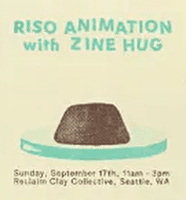 
[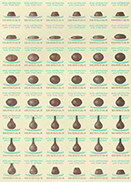](demo/7_riso_zinehug_clay.png)
 Riso by Alex Barsky ([@zinehug](https://www.instagram.com/zinehug))

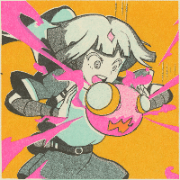 
[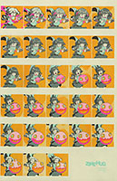](demo/8_riso_zinehug_summoner.jpg)
 "Summoner" Riso by Zack Lydon ([@zinehug](https://www.instagram.com/zinehug))

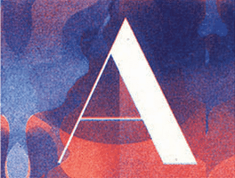 
[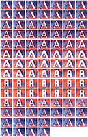](demo/9_riso_kellianderson.jpg)
 "A" Riso by Kelli Anderson ([@kellianderson](https://www.instagram.com/kellianderson/))  

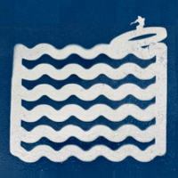
[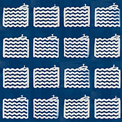](demo/10_cyano_kellianderson.png)
 Cyanotype by Kelli Anderson ([@kellianderson](https://www.instagram.com/kellianderson/)) 

<!-- 

References: 

* [Spectrolite Riso Animation](https://spectrolite.app/how-to/art-and-animation/riso-animation)

-->
