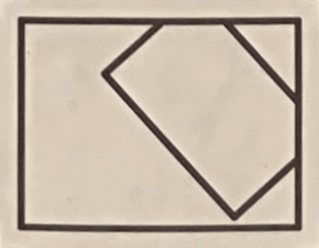

# Plottimation Tool

[This tool](https://golanlevin.github.io/plottimation/) builds a looping animation from a photograph of a plotted frame-sheet. 
Version 1.08 • April 2026 • By @GolanLevin

* [**Plottimation Tool Online Here**](https://golanlevin.github.io/plottimation/)
* [**Quickstart Instructions**](#quickstart-instructions)
* [Demo Video](https://www.youtube.com/watch?v=MOXB63DgItQ) • [Docs](documentation.md) 
• [Gallery](#plottimation-gif-gallery)

## Quickstart Instructions

1. **Create** a "frame sheet" of your animation. Your sheet should contain a grid of frames separated by small crosses `+` or filled circular dots `●`. Your sheet should also be completely surrounded by a dark background, as in [this example](demo/1_dmawer_crosses.jpg). 
2. **Open** the [**Plottimation Tool**](https://golanlevin.github.io/plottimation/) in a browser, from [here](https://golanlevin.github.io/plottimation).
3. **Load** the image of your frame sheet into the Plottimation Tool. You can do this by dragging your image file onto the Tool's load target (where it says "Drop a photo or scan here"), or by clicking the target to load a file. As an alternative, you can click `Load Demo` instead.
4. Under the *Layout* tab, **set** `Frame Columns` and `Frame Rows` to match the layout of your sheet's grid of frames. You should also set your sheet's orientation (landscape or portrait) and page size (11×8.5, etc.).
5. On the "Raw Photo" panel, you should see a green line around your page. If the panel shows a warning symbol ⚠️, or if there is no green line around your sheet, or if the green line is incorrect, you may need to **adjust** the thresholding settings in the *Page & Grid Detection* tab. Try experimenting with the "Thresholding Offset" slider first. 
5. According to your taste, **adjust** the settings under the *Appearance* and *Crop & Geometry* tabs. Changes to these settings are reflected in the animation shown in the *Preview* panel.
7. To generate and download your GIF animation, **click** `Export GIF`. You can also download your animation as an MP4 movie or a folder of frames. There are advanced settings in the *Export Options* tab for adjusting output dimensions, compression quality, and playback modes.

---

## Plottimation GIF Gallery

 
 
 

