# Plottimation Documentation

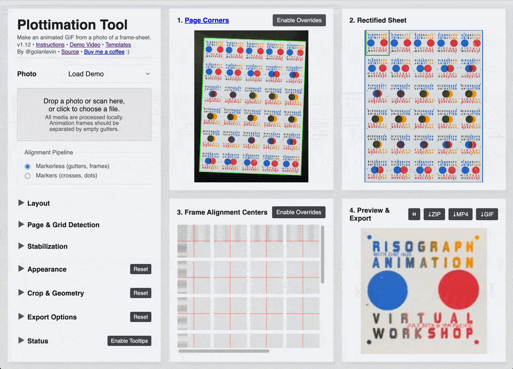

**Quick Links**

* [**Plottimation Tool**](https://golanlevin.github.io/plottimation/)
* [**Quickstart Instructions**](README.md#quickstart-instructions) 

**Contents**: 

* [Alignment Pipeline](#alignment-pipeline)
* [Layout](#layout)
* [Page & Grid Detection](#page--grid-detection)
* [Automatic Frame Alignment](#automatic-frame-alignment)
* [Stabilization](#stabilization)
* [Appearance](#appearance)
* [Crop & Geometry](#crop--geometry)
* [Export Options](#export-options)
* [Preview Panel Header Buttons](#preview-panel-header-buttons)
* [Status](#status)
* [Viewer Panels](#viewer-panels)
* [Sibling Settings Files](#sibling-settings-files)
* [Language Selection](#language-selection)


---

## Alignment Pipeline

*Use `Alignment Pipeline` to choose between the two different workflows for finding and aligning the animation frames.*

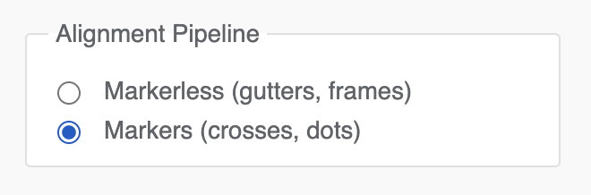

* `Markers (crosses, dots)` – 
  This mode expects a page with registration markers between frames. The markers can be small crosses (`+`) or filled circular dots (`●`), rendered in a high-contrast ink. This pipeline produces the most stable results.
* `Markerless (gutters, frames)` – 
  This mode estimates the frame grid without registration markers, strictly using the spacing and gutters between frames. Markerless alignment may be more "jittery" or inaccurate, depending on your design.


---

## Layout

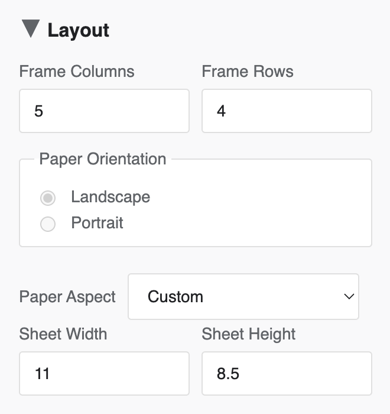

*Use `Layout` to tell the app how your frame-sheet is organized.*

* `Frame Columns` –
  Number of animation frames across the sheet.
* `Frame Rows` –
  Number of animation frames down the sheet.
* `Paper Orientation` –
  Choose `Landscape` or `Portrait`. This changes the effective aspect ratio used by the page warp.
* `Paper Aspect` –
  Select a preset paper format such as `Letter`, `Tabloid`, `A4`, `Source`, or `Custom`.
  * `Source (width:height)` – This option uses the raw source image dimensions as an aspect-ratio hint. This is still just an aspect guide; it does not request a rectified grid or export at that literal pixel size.
  * `Custom` –
  If `Paper Aspect` is set to `Custom`, the `Sheet Width` and `Sheet Height` fields appear. These are used only as aspect-ratio hints.


---

## Page & Grid Detection

*Use `Page & Grid Detection` to help the app find the paper and the outer boundary of the frame grid.*

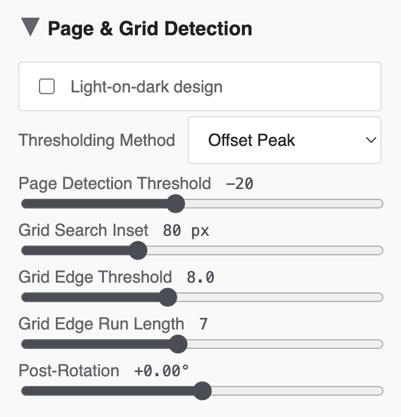

* `Light-on-dark design` – 
  Use this when the artwork consists of light regions on dark paper.
* `Thresholding Method` –
  Chooses how the raw image is thresholded for page detection. Choices include `Offset Peak` (a simple histogram-peak-based threshold); `Otsu` (OpenCV's Otsu global threshold); and `Triangle` (OpenCV's Triangle global threshold).
* `Page Detection Threshold` –
  Adjusts the threshold used to detect the page and its corners. This is often the first setting to try if page detection fails!
* `Grid Search Inset X` –
  Ignores this many pixels near the left and right edges of the rectified page before searching for the frame grid.
* `Grid Search Inset Y` –
  Ignores this many pixels near the top and bottom edges of the rectified page before searching for the frame grid.
* `Grid Edge Threshold` –
  Sets the minimum signal required to detect the outer rows and columns of markers.
* `Grid Edge Run Length` –
  Sets how many consecutive pixels must satisfy the grid edge threshold before a grid edge is accepted.
* `Post-Rotation` –
  Applies a small rotation to the rectified grid after page rectification and before frame alignment.

If the app cannot detect the page correctly, the `Page & Grid Detection` header will display a ⚠️ warning mark, and the `Status` panel will show:

```Unable to find page boundary. Try adjusting the Page Detection Threshold or other Page & Grid Detection settings.```

If automatic page-corner detection is close but not quite right, or if no page boundary can be detected at all, use the `Page Corners` panel:

* `Enable Overrides` –
  Turns on manual page-corner editing in the source image. Drag a green corner handle to correct its location.
  While you drag a corner, an enlarged inset helps with precise placement.
* no detected page boundary –
  If the app is in a page-boundary warning state and you click `Enable Overrides`, Plottimation creates a simple inset rectangle as a starting point. Drag its corners to match the actual page.
* `Clear Edits` –
  Removes the manual page-corner override and returns to automatic page detection.

While manual page-corner edits are active, `Page Detection Threshold` is disabled. Clear the edits first if you want the app to resume automatic page-corner detection. Manual page-corner edits are saved in exported settings files.


---

## Automatic Frame Alignment

*In the `Markers` pipeline, `Automatic Frame Alignment` refines the frame corners using the printed registration markers.*

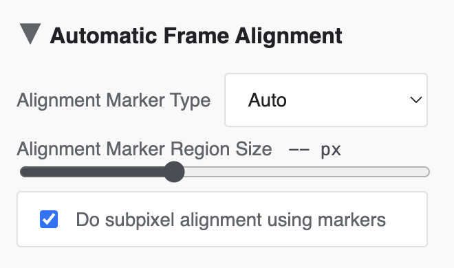

The `Markers` pipeline assumes the frames are separated by crosses or dots. If those markers are printed as light ink on dark paper, be sure to enable `Light-on-dark design` under `Page & Grid Detection`.

* `Alignment Marker Type` –
  Chooses the type of registration markers.
  - `Auto` –
    Tries to determine whether the sheet uses crosses or dots.
  - `Crosses` –
    Uses cross-shaped markers.
  - `Dots` –
    Uses dot-shaped markers.
* `Alignment Marker Region Size` –
  Sets the size of the square ROI used to inspect each alignment marker.
* `Detect crosses with convolution` –
  When enabled, each cross-marker ROI is localized using a convolution-based detector instead of the default profile-based method.

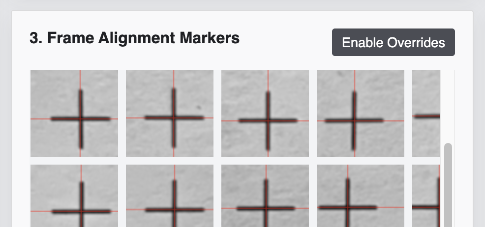

The `Frame Alignment Markers` panel displays the individual marker regions used for this step. In the desktop version of Plottimation, it is possible to manually override the positions of markers, if necessary:

* `Enable Overrides`
  Turns on interactive marker editing.
* drag a marker tile
  Repositions that marker's reticle and updates affected frames live.
* double-click an edited marker
  Restores it to the originally detected location.
* `Clear Edits`
  Removes all saved marker overrides.

Override edits are saved into exported settings files.


---

## Stabilization

*In `Markerless` mode, the `Automatic Frame Alignment` control area is replaced with `Stabilization` controls.*

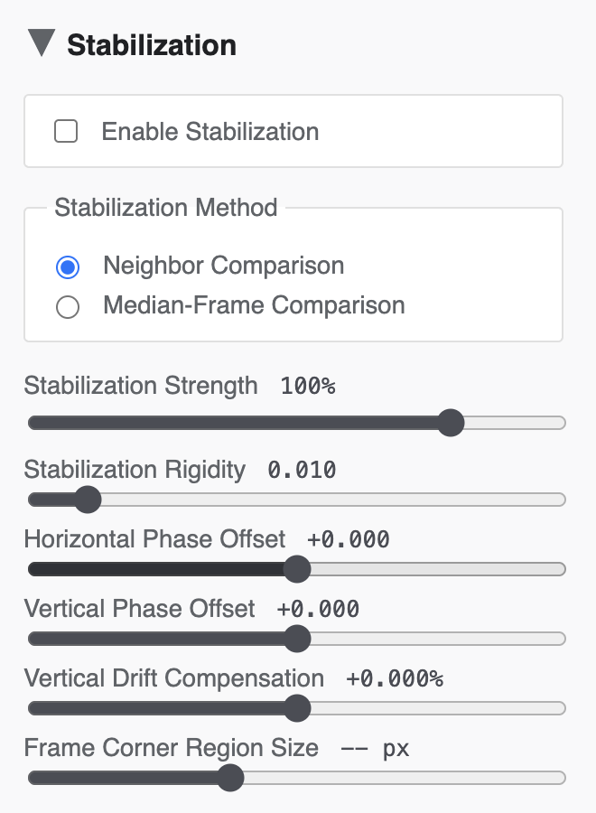

The Markerless alignment pipeline assumes:

* your sheet has no registration markers
* frames are arranged on a straight grid
* neighboring frames are separated by clear, empty gutters

The Markerless pipeline initially estimates a nominal grid, and then lets you refine it with post-estimation controls:

* `Enable Stabilization` –
  Turns stabilization on or off; when disabled, no stabilization is applied. *Note:* Stabilization consists only of changes in translation (not scale, rotation, shear, or perspective).
* `Grid Search Inset X` / `Grid Search Inset Y` –
  In Markerless mode, these define the horizontal and vertical insets used to initialize the grid search. Large empty page margins can confuse the grid estimation, so increasing these values can help the app ignore blank borders.
* `Stabilization Method` –
  Chooses between the two translation-only stabilization strategies:
  - `Neighbor Comparison` –
    Compares frames against neighboring frames in the sheet/loop and solves one weighted global offset field.
  - `Median-Frame Comparison` –
    Compares each frame independently against a single median reference frame built from the whole animation.
* `Stabilization Strength` –
  Scales the translation-only stabilization offsets from `0%` to `125%`.
* `Stabilization Rigidity` –
  Controls how resistant the neighbor-comparison solver is to large per-frame corrections. This control is inactive when `Median-Frame Comparison` is selected.
* `Horizontal Phase Offset` –
  Shifts the extracted grid left or right relative to the automatically estimated phase.
* `Vertical Phase Offset` –
  Shifts the extracted grid up or down relative to the automatically estimated phase.
* `Vertical Drift Compensation` –
  Applies a post-stabilization vertical correction distributed smoothly over the full animation to counter any top-to-bottom drift.
* `Frame Corner Region Size` –
  Sets the size of the square tiles shown in the corner editor. This does not change the extracted frame size.

The `Frame Alignment Centers` (or `Frame Alignment Markers`) viewer shows the current corner locations used for extraction. In Markerless mode, these are the stabilized corner positions, not raw marker detections.

In the desktop version, it is still possible in Markerless mode to edit individual alignment centers:

- `Enable Overrides` –
  Turns on interactive corner editing.
- drag a corner tile –
  Applies a post-stabilization extraction nudge at that corner.
- double-click an edited corner –
  Restores it to the current automatic location.
- `Clear Edits` –
  Removes all saved corner overrides.

Markerless overrides are post-stabilization nudges, so they do not feed back into the stabilization solve itself.

Technically, the grid pitch is estimated by applying an autocorrelation to a reduced blurred grayscale version of the rectified grid. The phase of the grid is estimated from a gutter-support metric built from a multiplicative combination of lightness, edge energy, and texture variance measurements.


---

## Appearance

*Use `Appearance` to adjust the look of the extracted animation frames after geometry is settled.*

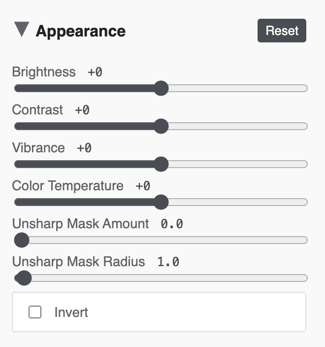

* `Brightness` –
  Raises or lowers perceptual lightness.
* `Contrast` –
  Expands or compresses tonal contrast around the midpoint.
* `Vibrance` –
  Boosts muted colors more than already-saturated colors.
* `Color Temperature` –
  Shifts the image cooler or warmer.
* `Unsharp Mask Amount` –
  Controls how strongly the sharpening effect is applied.
* `Unsharp Mask Radius` –
  Controls the blur radius used by the unsharp mask.
* `Invert` –
  Inverts the final extracted animation, like a negative.
* `Reset` –
  Restores all Appearance settings to defaults.


---

## Crop & Geometry

*Use `Crop & Geometry` to trim the extracted frame and apply simple post-crop transforms.*

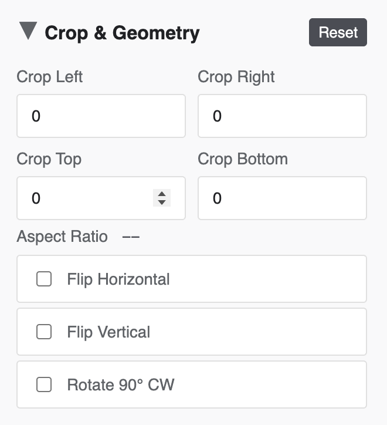

* `Crop Left` –
  Removes pixels from the left side of each frame.
* `Crop Right` –
  Removes pixels from the right side of each frame.
* `Crop Top` –
  Removes pixels from the top of each frame.
* `Crop Bottom` –
  Removes pixels from the bottom of each frame.
* `Aspect Ratio` –
  Read-only display showing the current post-crop aspect ratio and pixel dimensions.
* `Flip Horizontal` –
  Mirrors the output frames left-to-right.
* `Flip Vertical` –
  Mirrors the output frames top-to-bottom.
* `Rotate 90° CW` –
  Rotates the output frames clockwise.
* `Reset` –
  Restores all crop and geometry settings to defaults.

Cropping and geometry changes affect preview and all export formats.


---

## Export Options

Use `Export Options` to control the size, timing, ordering, and encoding of the exported animation.

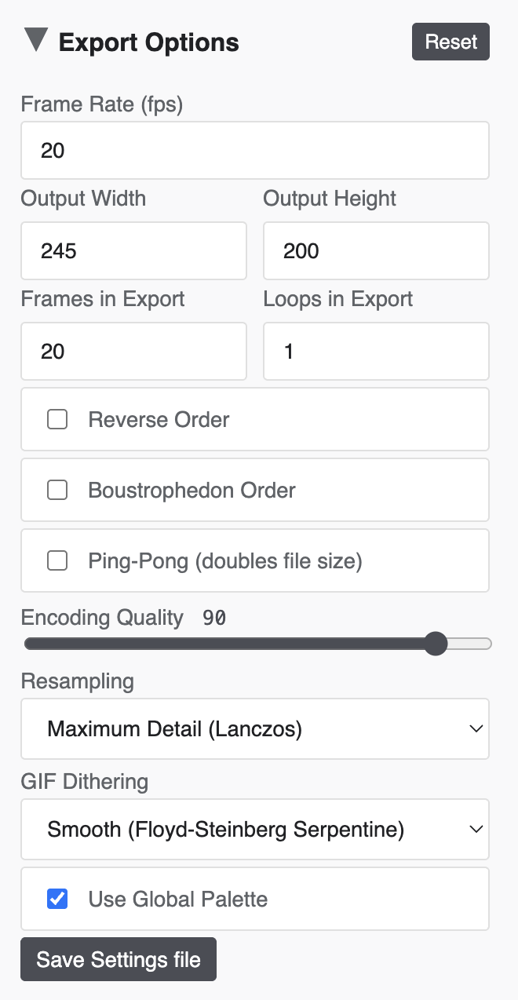

* `Frame Rate (fps)` –
  Playback rate for the live preview and for exported animation files.
* Output dimensions: 
  * `Output Width` –
  Final export width in pixels.
  * `Output Height` –
  Final export height in pixels.
  * These two fields stay proportional when edited.
* `Frames in Export` –
  Limits how many source cells are included in preview and export. If this is smaller than `Frame Columns × Frame Rows`, the highest-indexed frames are omitted.
* `Loops in Export` –
  Repeats the frame sequence in exported files only. It does not change the live preview.
* `Reverse Order` –
  Reverses frame order in both preview playback and exported files.
* `Boustrophedon Order` –
  Reads each printed row alternately left-to-right, then right-to-left, before any reverse or ping-pong expansion is applied.
* `Ping-Pong (doubles file size)` –
  Plays or exports the sequence forward and backward without duplicating the turnaround endpoints.
* `Encoding Quality` –
  Quality control for exported media. For GIF export, it controls lossy compression; for MP4 export, it drives the H.264 bitrate.
* `Resampling` –
  Chooses the interpolation method used during extraction and output resizing. Available options may include:
  - `Linear`
  - `Cubic`
  - `Maximum Detail (Lanczos)` 
  - `Strong Reduction (Area)`
  - `Pixelated (Nearest Neighbor)`
* `GIF Dithering` –
  Chooses the dithering algorithm used during GIF color quantization.
* `Use Global Palette` –
  Forces the GIF encoder to use one palette for all frames.
* `Save Settings file` –
  Downloads a standalone settings text file.
* `Reset` –
  Restores Export Options to defaults and returns output size to the native extracted frame size.


---

## Preview Panel Header Buttons

*The `Preview & Export` panel header contains the export actions.*

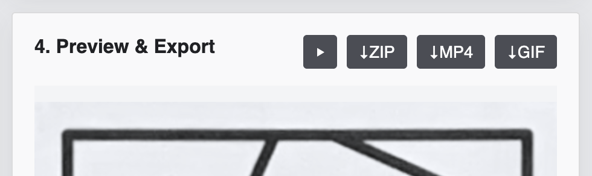

* `Play/Pause` –
  Starts or stops the live preview animation.
* `↓GIF` –
  Generates and downloads an animated GIF.
* `↓MP4` –
  Downloads an H.264 movie (if your browser supports WebCodecs + MP4 muxing).
* `↓ZIP` –
  Downloads a ZIP archive (containing PNG frames in a `frames/` folder, and a settings text file)

After a GIF has been generated, the `Preview & Export` heading text also becomes a download link to that GIF for the current browser session.


---

## Status

*The `Status` panel reports the current state of the pipeline.*

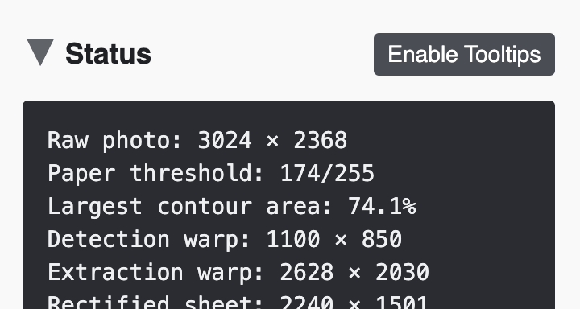

Typical messages and diagnostic data include:

* image loading
* loaded source credits, when included in a settings file
* page analysis
* frame extraction counts
* export progress
* failure details

The `Enable Tooltips` / `Disable Tooltips` button in the panel header toggles explanatory tooltips for the entire interface, including pipeline-specific controls in both `Markers` and `Markerless` modes. 


---

## Viewer Panels

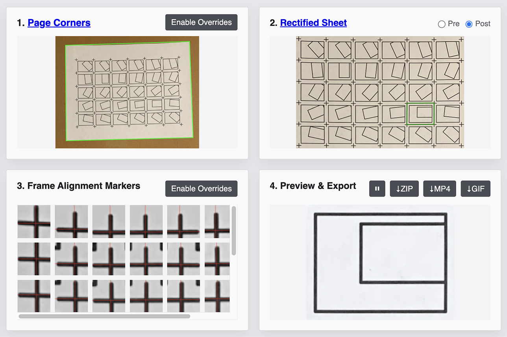

The four main viewer panels are:

1. `Page Corners` –
  Shows the source photo, with the detected or manually edited page outline drawn in green. The header buttons let you enable manual page-corner overrides and clear them when needed.
2. `Rectified Grid` –
  Shows either the full rectified page warp or the cropped rectified grid used for frame extraction, along with the current frame quad. Use the header's `Pre` / `Post` buttons to switch between those two views:
  - `Pre` shows the full page warp before frame-grid crop/re-rectification. In `Pre`, the blue outline shows the detected frame-grid search result and the magenta outline shows the current `Grid Search Inset X/Y` region.
  - `Post` shows the cropped extraction-space grid used for frame extraction.
  - On very large source images, this panel may display a downscaled preview of the rectified grid even though extraction still uses the full-resolution rectified image internally. In markerless mode it can also show the blue inset ROI rectangle used for the markerless search.
  - If `Frames in Export` omits cells, those omitted source cells are shown here as red slashed quads with a translucent gray fill.
3. `Frame Alignment Markers` or `3. Frame Alignment Centers` –
  In `Markers` mode, this panel shows the marker ROI tiles used for frame alignment. In `Markerless` mode, it shows the extracted corner tiles used for corner nudging.
4. `Preview & Export` –
  Shows the live animation preview and the export controls. After `↓GIF` has generated an exported GIF, the `Preview & Export` heading text links to that GIF using the exported filename.


### Mobile Display

On mobile devices: 

* some advanced controls are hidden
* the interface switches to a single-column layout with tabs for `Page`, `Rectified`, `Markers` or `Centers`, and `Preview`
* in markerless mode, the third mobile control tab is renamed `Stabilize`
* the marker panel is read-only
* the `Status` panel moves to the bottom


---

## Sibling Settings Files

*Plottimation can save and reload a companion settings file for a given source image.*

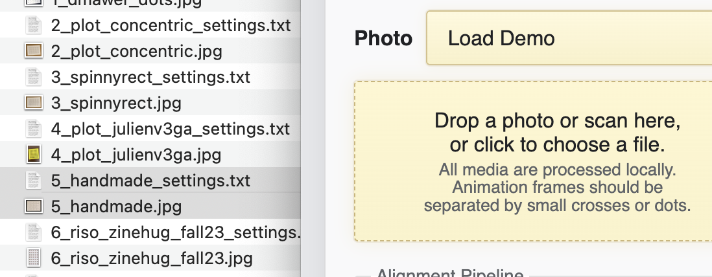

The settings filename format is: `<imagename>_settings.txt`. For example:

- `myDrawing.jpg`
- `myDrawing_settings.txt`

These settings files store the current UI state, including:

* page layout specifications
* frame detection and alignment settings
* appearance settings
* crop/export settings
* any manual page-corner overrides
* any manual marker overrides
* optional metadata

How they are used:

* if you drag an image and its matching settings file together, both will be loaded
* if you drag a settings file onto an already loaded image, it will override the current settings for that image
* `Save Settings file` (in `Export Options`) allows you to save the current settings file. 
* When exporting a ZIP bundle, the settings file is also included.

Note:

* Pressing `Reset` restores built-in defaults, not values from a loaded settings file
* If you load a lone local image file from the browser file picker, the browser's security settings do not permit the app to inspect the rest of that directory automatically, so a sibling settings file may need to be provided separately.


---

## Language Selection

*The Plottimation app supports automatic and user-selected localization.*

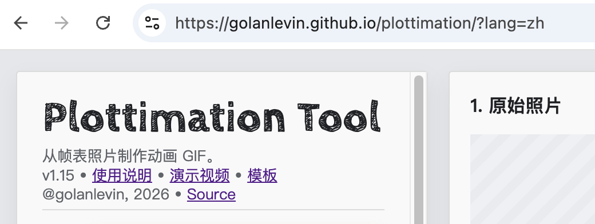

- By default, Plottimation uses the language preferences reported by your browser.
- If the browser prefers a supported language, the interface will switch automatically.
- If no supported language is detected, the app falls back to English.

You can also force a specific language with the page URL. The following internationalizations are available:

- `?lang=en` for English
- `?lang=fr` for French
- `?lang=es` for Spanish
- `?lang=it` for Italian
- `?lang=ja` for Japanese
- `?lang=zh` for Simplified Chinese
- `?lang=zh-hant` for Traditional Chinese
- `?lang=ko` for Korean
- `?lang=pt` for Portuguese
- `?lang=de` for German
- `?lang=pl` for Polish
- `?lang=nb` for Norwegian Bokmal
- `?lang=uk` for Ukrainian

The `?lang=` query parameter overrides browser-language detection.

Examples:

- `.../plottimation_webtool/?lang=en`
- `.../plottimation_webtool/?lang=fr`

---
