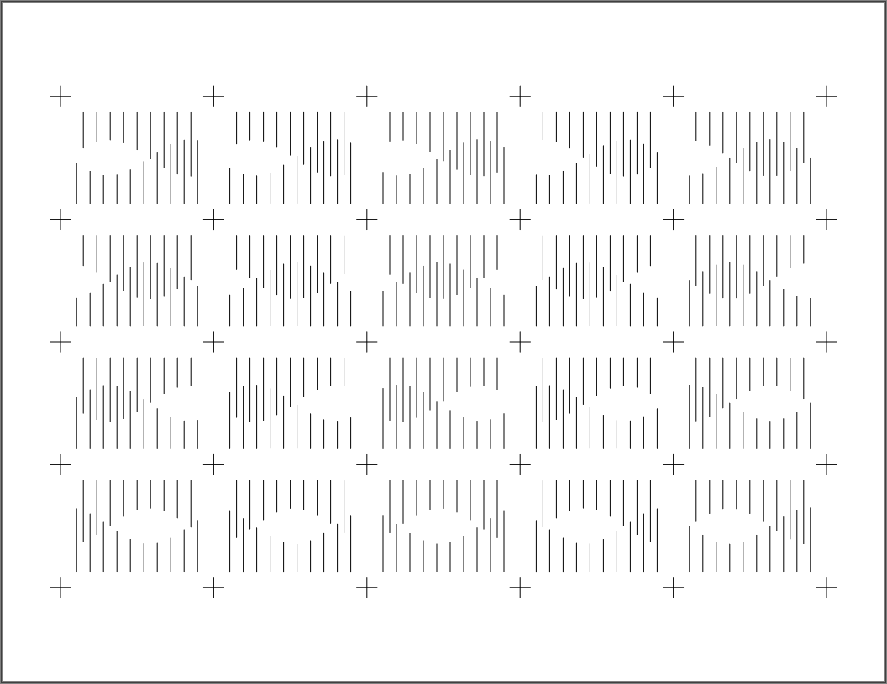

# Plottimation Templates

Tools and code to help make frame-sheets for the Plottimation Tool.

---

## p5.js Starter Sketch

[**Here's a p5.js sketch**](https://editor.p5js.org/golan/sketches/_ZMbagYFc) you can use to get started making frame-sheets: 

* [At editor.p5js.org](https://editor.p5js.org/golan/sketches/_ZMbagYFc)
* [In this repository](grid-animation-svg-generator/sketch.js)

The repository copy includes compact p5.js controls for choosing:

* marker type: `Crosses` or `Dots`
* animation design: `Design 1`, `Design 2`, or `Design 3`

Keyboard shortcuts are still available: `1`-`3` select designs, `x` selects crosses, `d` selects dots, and `s` exports SVG.

---

## Animation Grid Generator

The [Animation Grid Generator](animation-grid-generator/index.html) generates printable grids suited for making hand-drawn GIF animations with the Plottimation Tool. 

