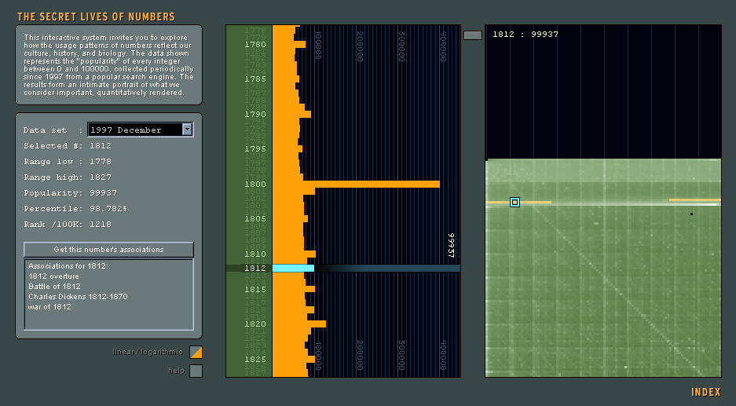
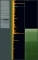
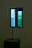

# The Secret Lives of Numbers

2002, by Golan Levin, Jonathan Feinberg, Shelly Wynecoop and Martin Wattenberg

---

[**The Secret Lives of Numbers**](applet.html) (2002: Golan Levin, Jonathan Feinberg, Shelly Wynecoop and Martin Wattenberg) is an interactive data visualization and online artwork, commissioned by Turbulence.org. An exhaustive empirical study was conducted to determine the relative popularity of every integer between one and one million. The resulting information exhibits an extraordinary variety of patterns which reflect our culture, our minds, and our bodiesforming a numeric snapshot of the collective consciousness. In The Secret Lives of Numbers, these analyses are returned to the public in the form of an interactive visualization, whose aim is to provoke awareness of ones own numeric manifestations.

* [**Landing Page (Index)**](index.html)
* [**Interactive Visualization**](applet.html) 
* [**Statement**](statement.html)

---

## Overview

The authors conducted an exhaustive empirical study, with the aid of custom software, public search engines and powerful statistical techniques, in order to determine the relative popularity of every integer between one and one million. The resulting information, presented in an interactive online [**information visualization**](applet.html), exhibits an extraordinary variety of patterns which reflect our culture, our minds, and our bodies.

For example, certain numbers, such as 212, 486, 911, 1040, 1492, 1776, 68040, or 90210, occur more frequently than their neighbors because they are used to denominate the phone numbers, tax forms, computer chips, famous dates, or television programs that figure prominently in our culture. Regular periodicities in the data, located at multiples and powers of ten, mirror our cognitive preference for round numbers in our biologically-driven base-10 numbering system. Certain numbers, such as 12345, appear to be more popular simply because they are easier to remember.

Humanity's fascination with numbers is ancient and complex. Our present relationship with numbers reveals both a highly developed tool and a highly developed user, working together to measure, create, and predict both ourselves and the world around us. But like every symbiotic couple, the tool we would like to believe is separate from us (and thus objective) is actually an intricate reflection of our thoughts, interests, and capabilities. One intriguing result of this symbiosis is that the numeric system we use to describe patterns, is actually used in a patterned fashion to describe. We surmise that our dataset is a numeric snapshot of the collective consciousness. Herein we return our analyses to the public in the form of an [**information visualization**](applet.html), whose aim is to provoke awareness of ones own numeric manifestations.

*The Secret Lives of Numbers* was commissioned by New Radio and Performing Arts, Inc., for its *Turbulence.org* web site, and premiered in February 2002. It was made possible with funding from The Greenwall Foundation. We express our gratitude to Helen Thorington, of New Radio and Performing Arts, for her support for this project.

The Secret Lives of Numbers, as presented at the Taiwan Museum of Art, July 2004. [YouTube Vimeo]

<!-- https://www.youtube.com/watch?v=vwwq8vJb9Sw -->

---

## Exhibition History

[*The Secret Lives of Numbers*]() was selected for inclusion in the [2004 Whitney Biennial](https://whitney.org/artists/8450) of American Art, and has been recognized with an Award of Distinction in the "Net Vision / Net Excellence" category of the [2003 Prix Ars Electronica](https://archive.aec.at/prix/152082/). The project has been presented in the following exhibitions, among others:

* [*The Algorithmic Revolution*](https://1995-2015.undo.net/it/evento/38812), in *Spazio Deformato* at *ArteScienza Festival*, Casa dell’Architettura, Rome, Italy: *Secret Lives of Numbers*, *Yellowtail*, *Messa di Voce* installations. 5/2006.
* [*The Algorithmic Revolution: On the History of Interactive Art*](https://zkm.de/en/exhibition/2004/10/algorithmic-revolution). ZKM (Center for Art and Media), Karlsruhe, Germany. 10/2004.
* [*Rhizome ArtBase 101*](https://archive.rhizome.org/exhibition/artbase101/), New Museum of Contemporary Art, Chelsea Museum, NYC. 6/2005.
* [*Open Space 2007*](https://www.ntticc.or.jp/en/exhibitions/2007/open-space-2007/). NTT InterCommunications Center (ICC), Tokyo. 4/2007-3/2008.
* [*Generator.X*](https://web.archive.org/web/20160328171822/http://www.generatorx.no/generatorx-exhibition/). Tou Scene Culture Center, Stavanger, Norway. 1/2006.
* [*Navigator: Digital Art in the Making*](https://aaa.org.hk/en/collections/search/library/navigator-digital-art-in-the-making-2004). Taiwan Museum of Art, Taichung, Taiwan. 7/2004.
* [*Whitney Biennial 2004*](http://whitney.org/www/2004biennial/flash/poplg.php). Whitney Museum of American Art, NYC. 3/2004.
* [*2003 Prix Ars Electronica Exhibition*](https://archive.aec.at/prix/152082/). Linz, Austria. 9/2003.

---

## Images

*Click to enlarge. Additional images are available [here](https://www.flickr.com/photos/golanlevin/albums/72157594388612317/).*

 
 
 